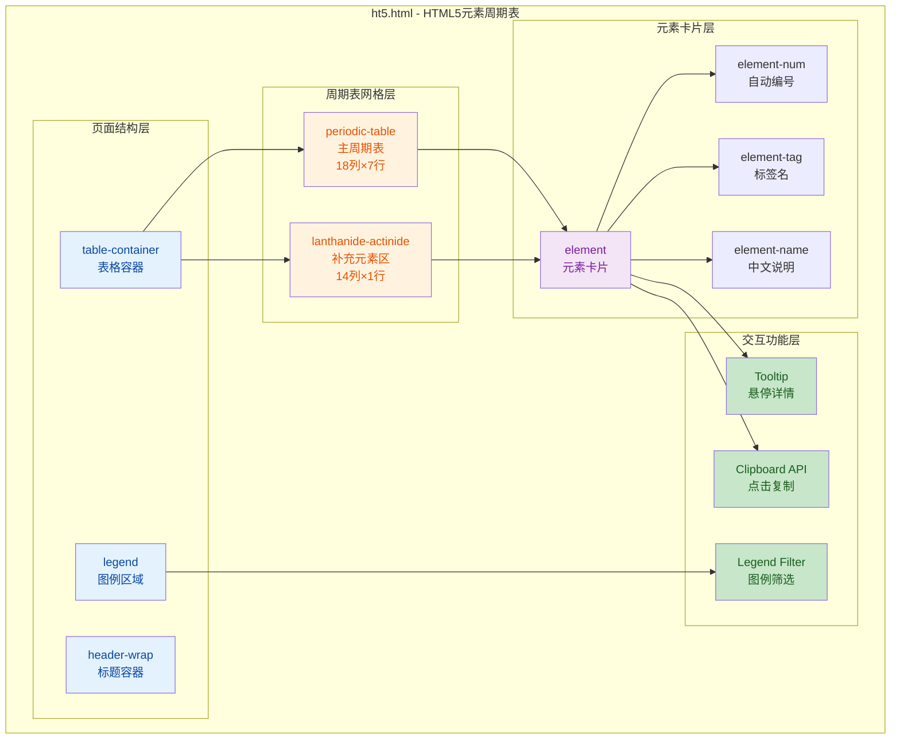

## 1. 高层摘要 (TL;DR)

- **影响范围:** 🟢 低 - 新增一个独立的HTML可视化页面,不涉及现有代码修改
- **核心变更:**
  - ✨ 创建了一个交互式的 **HTML5元素周期表** 页面,以类似化学元素周期表的方式展示所有HTML5标签
  - 🎨 使用 **CSS Grid** 布局实现18列×7行的主周期表 + 底部补充元素区域
  - 🎯 按功能类别对元素进行**颜色编码分类**(9大类别,渐变色背景)
  - 🖱️ 实现了**悬停详情提示**、**点击复制标签**、**图例筛选**等交互功能
  - 📱 支持**响应式布局**,适配不同屏幕尺寸

***

## 2. 可视化概览 (代码与逻辑映射)



***

## 3. 详细变更分析

### 📁 组件: `ht5.html` (新增文件)

#### 🎨 核心设计理念

这是一个**教育可视化工具**,将HTML5的100+个元素按照化学元素周期表的形式组织,帮助开发者快速学习和记忆HTML标签体系。

#### 🏗️ 页面结构

| 区域         | 说明               | 关键技术                                                              |
| ---------- | ---------------- | ----------------------------------------------------------------- |
| **Header** | 页面标题 "HTML5 元素表" | 居中布局,响应式字体                                                        |
| **主周期表**   | 18列×7行网格,展示主要元素  | CSS Grid (`grid-template-columns: repeat(18, minmax(68px, 1fr))`) |
| **补充区域**   | 底部14列网格,展示特殊元素   | 偏移对齐主周期表 (`margin-left: calc(2 * (88px + 8px))`)                  |
| **图例**     | 9个分类的交互式图例       | Flexbox布局,悬停筛选                                                    |

#### 🎨 元素分类与配色

| 类别          | CSS类名              | 渐变背景                     | 包含元素示例                                                           |
| ----------- | ------------------ | ------------------------ | ---------------------------------------------------------------- |
| **根结构元素**   | `root-struct`      | 蓝色渐变 `#649ef8 → #a6d1fb` | `html`, `body`                                                   |
| **元数据元素**   | `metadata`         | 紫色渐变 `#aa96f5 → #dbd9fd` | `head`, `title`, `meta`, `link`, `style`, `script`               |
| **文本内容元素**  | `text-content`     | 绿色渐变 `#51dcbf → #a2f3e0` | `h1-h6`, `p`, `br`, `hr`, `pre`, `blockquote`                    |
| **语义化区块元素** | `section-semantic` | 橙色渐变 `#f7bd8d → #eedac2` | `header`, `nav`, `main`, `aside`, `footer`, `article`, `section` |
| **列表与表格元素** | `list-table`       | 红色渐变 `#f6998d → #fadbe0` | `ul`, `ol`, `li`, `table`, `tr`, `td`, `th`                      |
| **表单交互元素**  | `form-input`       | 黄色渐变 `#f9c76e → #fffabf` | `form`, `input`, `button`, `select`, `textarea`                  |
| **媒体与链接元素** | `media`            | 粉色渐变 `#ed87c2 → #f5d5eb` | `a`, `img`, `audio`, `video`, `canvas`, `svg`                    |
| **行内文本元素**  | `inline-text`      | 浅蓝渐变 `#a2c1f8 → #cddff8` | `span`, `strong`, `em`, `mark`, `code`, `sub`, `sup`             |
| **通用/其他元素** | `other`            | 灰蓝渐变 `#95a9c7 → #ccdffa` | `div`, `template`, `ruby`, `map`, `time`                         |

#### ⚡ 交互功能实现

**1. 悬停详情提示 (Tooltip)**

```javascript
// 动态创建Tooltip,跟随鼠标移动
element.addEventListener('mousemove', (e) => {
    // 智能边界检测,防止超出屏幕
    if (x + rect.width > window.innerWidth) x = e.clientX - rect.width - offsetX;
    if (y + rect.height > window.innerHeight) y = e.clientY - rect.height - offsetY;
});
```

**2. 点击复制标签**

```javascript
// 使用Clipboard API复制完整标签
navigator.clipboard.writeText(fullTag).then(() => {
    copyNotice.textContent = `${fullTag} 已复制到剪贴板！`;
    copyNotice.classList.add('show');
});
```

**3. 图例筛选**

```javascript
// 悬停图例时,非选中类别元素降低透明度
legendItem.addEventListener('mouseenter', () => {
    document.querySelectorAll('.element').forEach(el => {
        if (!el.classList.contains('empty') && !el.classList.contains(targetCategory)) {
            el.classList.add('low-opacity'); // opacity: 0.2
        }
    });
});
```

**4. 自动编号 (CSS计数器)**

```css
/* 使用CSS counter自动生成元素序号 */
.periodic-table {
    counter-reset: element-counter;
}
.element:not(.empty) {
    counter-increment: element-counter;
}
.element-num::before {
    content: counter(element-counter);
}
```

#### 📱 响应式设计

| 断点           | 调整内容                    |
| ------------ | ----------------------- |
| **≤ 1400px** | 网格列宽从 `68px` 缩小至 `45px` |
| **≤ 768px**  | 优化标题和容器的居中布局,增加底部内边距    |

***

## 4. 影响与风险评估

### ✅ 优势

- **零依赖:** 纯HTML/CSS/JS实现,无需任何外部库
- **教育价值:** 直观展示HTML5元素体系,适合学习和参考
- **用户体验:** 交互流畅,复制功能提升开发效率
- **可维护性:** 代码结构清晰,注释详细,易于扩展

### ⚠️ 潜在问题

- **浏览器兼容性:** `navigator.clipboard` API在部分旧浏览器中不支持(已添加错误处理)
- **移动端体验:** 悬停交互在触摸设备上可能不够友好(建议考虑点击切换)
- **性能:** 大量DOM元素(100+)可能影响低端设备性能(可考虑虚拟滚动优化)

### 🧪 测试建议

1. **功能测试:** 验证所有元素的悬停提示和复制功能
2. **兼容性测试:** 在Chrome、Firefox、Safari、Edge中测试
3. **响应式测试:** 在不同屏幕尺寸下验证布局是否正常
4. **边界测试:** 测试复制失败时的错误提示是否正确显示
5. **性能测试:** 在低端设备上测试页面加载和交互流畅度

***

## 5. 技术亮点

🌟 **CSS Grid布局:** 精确控制18列×7行的周期表布局,使用 `minmax()` 实现响应式列宽

🌟 **CSS计数器:** 巧妙使用 `counter-reset` 和 `counter-increment` 实现自动编号,无需JavaScript维护序号

🌟 **渐变色设计:** 9大类别使用不同的渐变色背景,视觉层次分明,易于区分

🌟 **智能边界检测:** Tooltip跟随鼠标时自动检测屏幕边界,防止提示框超出可视区域

🌟 **无障碍设计:** 使用语义化HTML标签,提升可访问性
