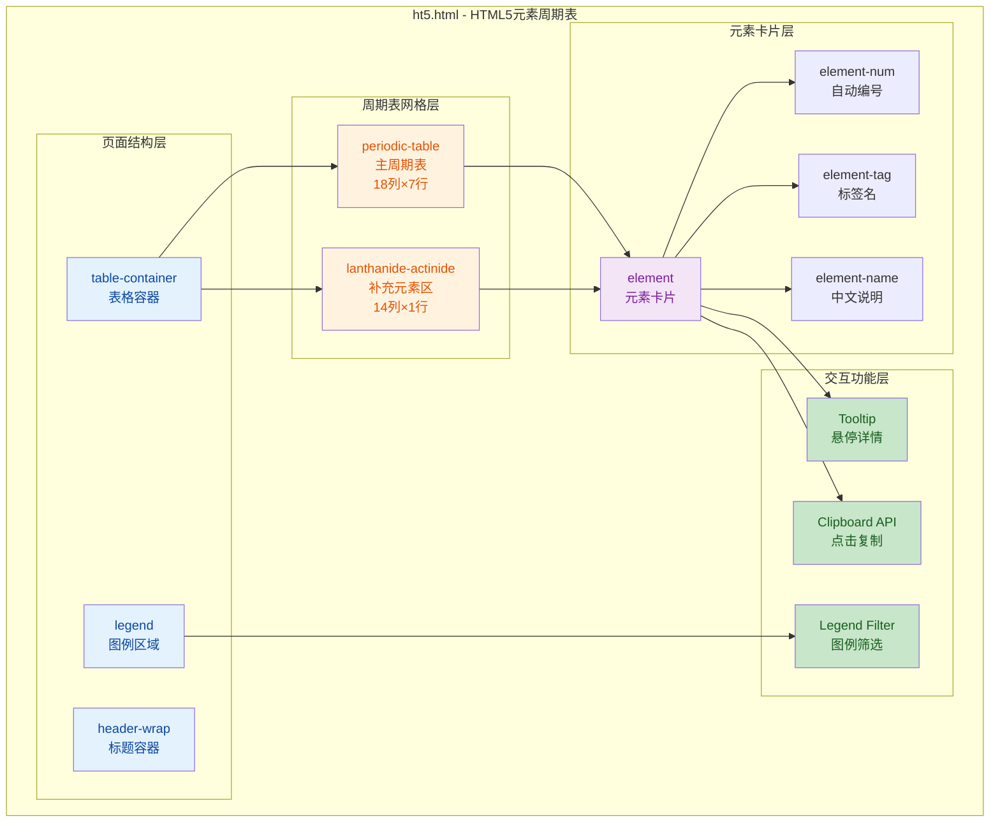
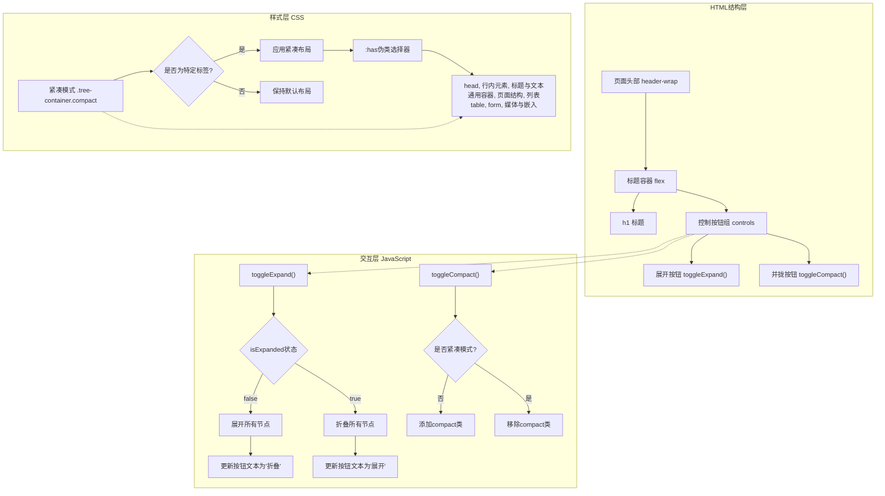

## 1. 高层摘要 (TL;DR)

- **影响范围:** 🟢 低 - 新增一个独立的HTML可视化页面,不涉及现有代码修改
- **核心变更:**
  - ✨ 创建了一个交互式的 **HTML5元素周期表** 页面,以类似化学元素周期表的方式展示所有HTML5标签
  - 🎨 使用 **CSS Grid** 布局实现18列×7行的主周期表 + 底部补充元素区域
  - 🎯 按功能类别对元素进行**颜色编码分类**(9大类别,渐变色背景)
  - 🖱️ 实现了**悬停详情提示**、**点击复制标签**、**图例筛选**等交互功能
  - 📱 支持**响应式布局**,适配不同屏幕尺寸

***

## 2. 可视化概览 (代码与逻辑映射)



***

## 3. 详细变更分析

### 📁 组件: `ht5.html` (新增文件)

#### 🎨 核心设计理念

这是一个**教育可视化工具**,将HTML5的100+个元素按照化学元素周期表的形式组织,帮助开发者快速学习和记忆HTML标签体系。

#### 🏗️ 页面结构

| 区域         | 说明               | 关键技术                                                              |
| ---------- | ---------------- | ----------------------------------------------------------------- |
| **Header** | 页面标题 "HTML5 元素表" | 居中布局,响应式字体                                                        |
| **主周期表**   | 18列×7行网格,展示主要元素  | CSS Grid (`grid-template-columns: repeat(18, minmax(68px, 1fr))`) |
| **补充区域**   | 底部14列网格,展示特殊元素   | 偏移对齐主周期表 (`margin-left: calc(2 * (88px + 8px))`)                  |
| **图例**     | 9个分类的交互式图例       | Flexbox布局,悬停筛选                                                    |

#### 🎨 元素分类与配色

| 类别          | CSS类名              | 渐变背景                     | 包含元素示例                                                           |
| ----------- | ------------------ | ------------------------ | ---------------------------------------------------------------- |
| **根结构元素**   | `root-struct`      | 蓝色渐变 `#649ef8 → #a6d1fb` | `html`, `body`                                                   |
| **元数据元素**   | `metadata`         | 紫色渐变 `#aa96f5 → #dbd9fd` | `head`, `title`, `meta`, `link`, `style`, `script`               |
| **文本内容元素**  | `text-content`     | 绿色渐变 `#51dcbf → #a2f3e0` | `h1-h6`, `p`, `br`, `hr`, `pre`, `blockquote`                    |
| **语义化区块元素** | `section-semantic` | 橙色渐变 `#f7bd8d → #eedac2` | `header`, `nav`, `main`, `aside`, `footer`, `article`, `section` |
| **列表与表格元素** | `list-table`       | 红色渐变 `#f6998d → #fadbe0` | `ul`, `ol`, `li`, `table`, `tr`, `td`, `th`                      |
| **表单交互元素**  | `form-input`       | 黄色渐变 `#f9c76e → #fffabf` | `form`, `input`, `button`, `select`, `textarea`                  |
| **媒体与链接元素** | `media`            | 粉色渐变 `#ed87c2 → #f5d5eb` | `a`, `img`, `audio`, `video`, `canvas`, `svg`                    |
| **行内文本元素**  | `inline-text`      | 浅蓝渐变 `#a2c1f8 → #cddff8` | `span`, `strong`, `em`, `mark`, `code`, `sub`, `sup`             |
| **通用/其他元素** | `other`            | 灰蓝渐变 `#95a9c7 → #ccdffa` | `div`, `template`, `ruby`, `map`, `time`                         |

#### ⚡ 交互功能实现

**1. 悬停详情提示 (Tooltip)**

```javascript
// 动态创建Tooltip,跟随鼠标移动
element.addEventListener('mousemove', (e) => {
    // 智能边界检测,防止超出屏幕
    if (x + rect.width > window.innerWidth) x = e.clientX - rect.width - offsetX;
    if (y + rect.height > window.innerHeight) y = e.clientY - rect.height - offsetY;
});
```

**2. 点击复制标签**

```javascript
// 使用Clipboard API复制完整标签
navigator.clipboard.writeText(fullTag).then(() => {
    copyNotice.textContent = `${fullTag} 已复制到剪贴板！`;
    copyNotice.classList.add('show');
});
```

**3. 图例筛选**

```javascript
// 悬停图例时,非选中类别元素降低透明度
legendItem.addEventListener('mouseenter', () => {
    document.querySelectorAll('.element').forEach(el => {
        if (!el.classList.contains('empty') && !el.classList.contains(targetCategory)) {
            el.classList.add('low-opacity'); // opacity: 0.2
        }
    });
});
```

**4. 自动编号 (CSS计数器)**

```css
/* 使用CSS counter自动生成元素序号 */
.periodic-table {
    counter-reset: element-counter;
}
.element:not(.empty) {
    counter-increment: element-counter;
}
.element-num::before {
    content: counter(element-counter);
}
```

#### 📱 响应式设计

| 断点           | 调整内容                    |
| ------------ | ----------------------- |
| **≤ 1400px** | 网格列宽从 `68px` 缩小至 `45px` |
| **≤ 768px**  | 优化标题和容器的居中布局,增加底部内边距    |

***

## 4. 影响与风险评估

### ✅ 优势

- **零依赖:** 纯HTML/CSS/JS实现,无需任何外部库
- **教育价值:** 直观展示HTML5元素体系,适合学习和参考
- **用户体验:** 交互流畅,复制功能提升开发效率
- **可维护性:** 代码结构清晰,注释详细,易于扩展

### ⚠️ 潜在问题

- **浏览器兼容性:** `navigator.clipboard` API在部分旧浏览器中不支持(已添加错误处理)
- **移动端体验:** 悬停交互在触摸设备上可能不够友好(建议考虑点击切换)
- **性能:** 大量DOM元素(100+)可能影响低端设备性能(可考虑虚拟滚动优化)

### 🧪 测试建议

1. **功能测试:** 验证所有元素的悬停提示和复制功能
2. **兼容性测试:** 在Chrome、Firefox、Safari、Edge中测试
3. **响应式测试:** 在不同屏幕尺寸下验证布局是否正常
4. **边界测试:** 测试复制失败时的错误提示是否正确显示
5. **性能测试:** 在低端设备上测试页面加载和交互流畅度

***

## 5. 技术亮点

🌟 **CSS Grid布局:** 精确控制18列×7行的周期表布局,使用 `minmax()` 实现响应式列宽

🌟 **CSS计数器:** 巧妙使用 `counter-reset` 和 `counter-increment` 实现自动编号,无需JavaScript维护序号

🌟 **渐变色设计:** 9大类别使用不同的渐变色背景,视觉层次分明,易于区分

🌟 **智能边界检测:** Tooltip跟随鼠标时自动检测屏幕边界,防止提示框超出可视区域

🌟 **无障碍设计:** 使用语义化HTML标签,提升可访问性

<br />

<br />

## 1. 高层摘要（TL;DR）

- **影响范围：** 中等 - 优化了HTML5元素树可视化工具的布局、样式和交互逻辑
- **核心变更：**
  - 🎨 **重构紧凑模式样式** - 使用 `:has()` 伪类实现精确的样式控制，仅对特定标签应用紧凑布局
  - 🔄 **合并展开/折叠功能** - 将 `expandAll()` 和 `collapseAll()` 合并为 `toggleExpand()`，支持状态切换
  - 📍 **优化控制按钮布局** - 将控制按钮移至标题右侧，简化按钮数量
  - 📝 **代码格式化** - 统一数据结构缩进，添加详细注释

***

## 2. 可视化概览（代码与逻辑映射）



***

## 3. 详细变更分析

### 🎨 **样式层变更（CSS）**

#### **控制按钮区域重构**

| 属性                | 旧值            | 新值 | 说明         |
| :---------------- | :------------ | :- | :--------- |
| `max-width`       | `1400px`      | 移除 | 不再限制最大宽度   |
| `margin`          | `0 auto 20px` | 移除 | 不再居中和设置下边距 |
| `justify-content` | `flex-end`    | 移除 | 不再右对齐      |

**影响：** 按钮区域现在由父容器控制布局，更灵活。

#### **紧凑模式样式精确化（核心变更）**

**旧选择器：**

```css
.tree-container.compact .tree-node .children { ... }
```

**新选择器：**

```css
.tree-container.compact .tree-node:has(
    > .node-content[data-tag="head"],
    > .node-content[data-tag="行内元素"],
    > .node-content[data-tag="标题与文本"],
    > .node-content[data-tag="通用容器"],
    > .node-content[data-tag="页面结构"],
    > .node-content[data-tag="列表"],
    > .node-content[data-tag="table"],
    > .node-content[data-tag="form"],
    > .node-content[data-tag="媒体与嵌入"]
) .children.show { ... }
```

**关键改进：**

- ✅ 使用 `:has()` 伪类实现**精确匹配**
- ✅ 添加 `.show` 类，仅在展开状态应用紧凑样式
- ✅ 仅对9个特定标签应用紧凑布局
- ✅ 避免影响其他节点的默认样式

**受影响的样式规则：**

| 规则                                           | 变更内容         |
| :------------------------------------------- | :----------- |
| `.children.show`                             | Flex布局、间距、边距 |
| `.children.show .tree-node`                  | 移除左边距        |
| `.children.show .node-content`               | 内边距、最小宽度     |
| `.children.show .element-name/.element-desc` | 隐藏显示         |
| `.children.show .toggle-icon.leaf`           | 隐藏显示         |

***

### 🔄 **交互层变更（JavaScript）**

#### **展开/折叠功能合并**

**旧代码：**

```javascript
function expandAll() { /* 展开所有 */ }
function collapseAll() { /* 折叠所有 */ }
```

**新代码：**

```javascript
let isExpanded = false;

function toggleExpand() {
    isExpanded = !isExpanded;
    const btn = document.querySelector('button[onclick="toggleExpand()"]');
    
    if (isExpanded) {
        // 展开所有节点
        btn.textContent = '折叠';
        btn.classList.add('active');
    } else {
        // 折叠所有节点
        btn.textContent = '展开';
        btn.classList.remove('active');
    }
}
```

**改进点：**

- ✅ 单一按钮控制展开/折叠
- ✅ 按钮文本动态切换（"展开" ↔ "折叠"）
- ✅ 按钮状态视觉反馈（添加/移除 `active` 类）
- ✅ 使用状态变量 `isExpanded` 跟踪当前状态

#### **节点创建增强**

**新增属性：**

```javascript
contentDiv.setAttribute('data-tag', node.tag);
```

**作用：** 为每个节点添加 `data-tag` 属性，支持CSS `:has()` 选择器精确匹配。

#### **代码注释完善**

添加了详细的JSDoc注释：

```javascript
/**
 * 递归创建树节点
 * @param {Object} node - 节点数据
 * @param {number} level - 节点层级
 * @returns {HTMLElement} 创建的节点元素
 */
```

***

### 📐 **HTML结构变更**

#### **头部布局重构**

**旧结构：**

```html
<div class="header-wrap">
    <h1>HTML5 元素层级结构</h1>
    <div class="subtitle">...</div>
</div>
<div class="controls">
    <button onclick="expandAll()">全部展开</button>
    <button onclick="collapseAll()">全部折叠</button>
    <button onclick="toggleCompact()">并拢</button>
</div>
```

**新结构：**

```html
<div class="header-wrap">
    <div style="display: flex; align-items: center; justify-content: center; max-width: 1400px; margin: 0 auto 30px; position: relative;">
        <h1>HTML5 元素层级结构</h1>
        <div class="controls" style="position: absolute; right: 0;">
            <button class="control-btn" onclick="toggleExpand()">展开</button>
            <button class="control-btn" onclick="toggleCompact()">并拢</button>
        </div>
    </div>
    <div class="subtitle">...</div>
</div>
```

**改进点：**

- ✅ 控制按钮移至标题右侧，节省垂直空间
- ✅ 减少按钮数量（3个 → 2个）
- ✅ 使用Flexbox布局，更灵活

***

### 📊 **数据结构格式化**

对 `htmlElementsTree` 对象中的多个嵌套结构进行了格式化，包括：

| 区域                  | 变更内容                                    |
| :------------------ | :-------------------------------------- |
| **details/summary** | 统一缩进，提升可读性                              |
| **列表元素（ul/ol/dl）**  | 格式化嵌套结构                                 |
| **表格元素**            | 扁平化层级，将 `table` 从父级移至根级                 |
| **表单元素**            | 扁平化层级，将 `form` 从父级移至根级                  |
| **媒体元素**            | 格式化 audio/video/object/figure/map 的嵌套结构 |
| **其他元素**            | 格式化 ruby 注音容器结构                         |

**示例变更（表格元素）：**

```javascript
// 旧结构
{
    tag: '表格',
    name: '表格元素',
    children: [
        { tag: 'table', name: '表格', children: [...] }
    ]
}

// 新结构
{
    tag: 'table',
    name: '表格容器',
    desc: '创建表格',
    children: [
        { tag: 'caption', ... },
        { tag: 'thead', ... },
        ...
    ]
}
```

***

## 4. 影响与风险评估

### ⚠️ **潜在风险**

| 风险项        | 描述                           | 缓解措施                                               |
| :--------- | :--------------------------- | :------------------------------------------------- |
| **浏览器兼容性** | `:has()` 伪类在旧版浏览器中不支持        | 建议使用现代浏览器（Chrome 105+, Firefox 121+, Safari 15.4+） |
| **样式覆盖**   | 紧凑模式仅对特定标签生效，其他标签保持原样        | 测试所有标签的展开/折叠行为                                     |
| **状态同步**   | `isExpanded` 状态可能与实际DOM状态不同步 | 确保每次点击都正确更新状态                                      |

### ✅ **测试建议**

1. **功能测试**
   - 点击"展开"按钮，验证所有节点是否正确展开
   - 点击"折叠"按钮，验证所有节点是否正确折叠
   - 点击"并拢"按钮，验证紧凑模式是否正确应用
   - 在紧凑模式下，验证特定标签（head、行内元素等）的子元素是否正确并拢
2. **样式测试**
   - 验证控制按钮是否位于标题右侧
   - 验证紧凑模式下特定标签的子元素是否横向排列
   - 验证紧凑模式下元素名称和描述是否隐藏
   - 验证响应式布局在不同屏幕尺寸下的表现
3. **兼容性测试**
   - 在Chrome、Firefox、Safari、Edge等现代浏览器中测试
   - 验证 `:has()` 伪类是否正常工作
4. **交互测试**
   - 验证点击节点展开/折叠功能是否正常
   - 验证悬停提示框是否正常显示
   - 验证点击叶子节点复制标签功能是否正常

***

## 5. 总结

本次变更主要优化了HTML5元素树可视化工具的**用户体验**和**代码质量**：

1. **🎯 更精确的样式控制** - 使用 `:has()` 伪类实现智能紧凑模式
2. **🔄 更简洁的交互逻辑** - 合并展开/折叠功能，减少按钮数量
3. **📍 更合理的布局** - 控制按钮移至标题右侧，节省空间
4. **📝 更规范的代码** - 统一格式化，添加详细注释

这些改进提升了工具的**可用性**和**可维护性**，同时保持了向后兼容性。
